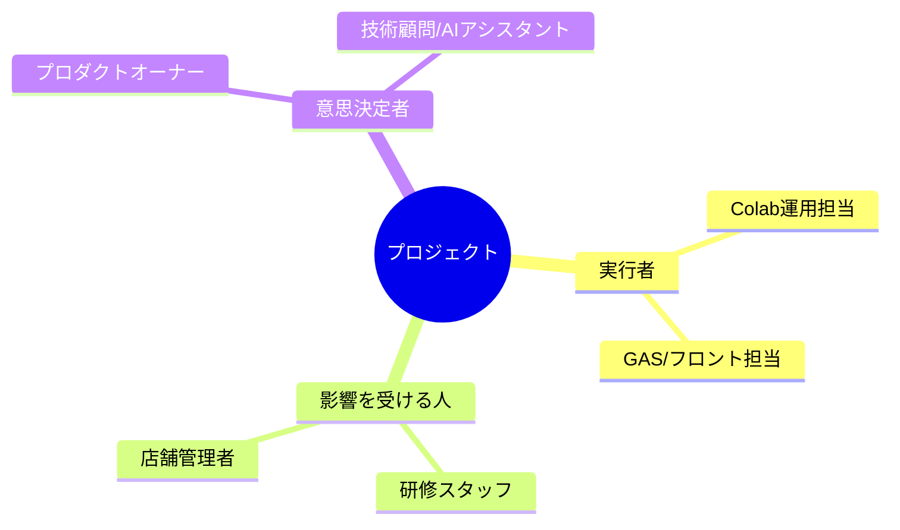
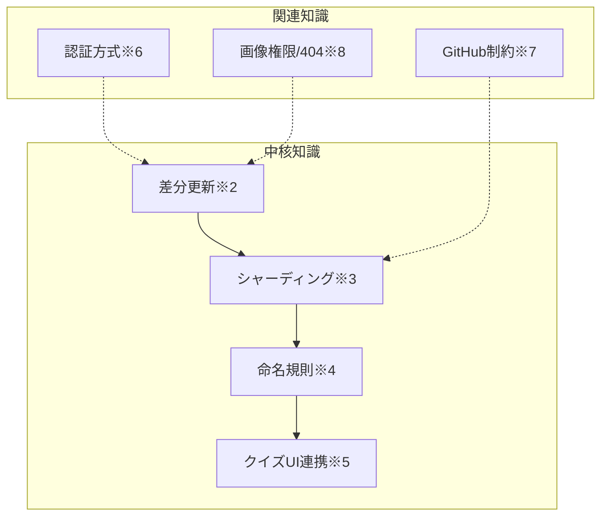
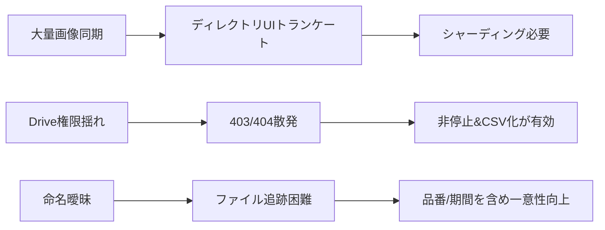
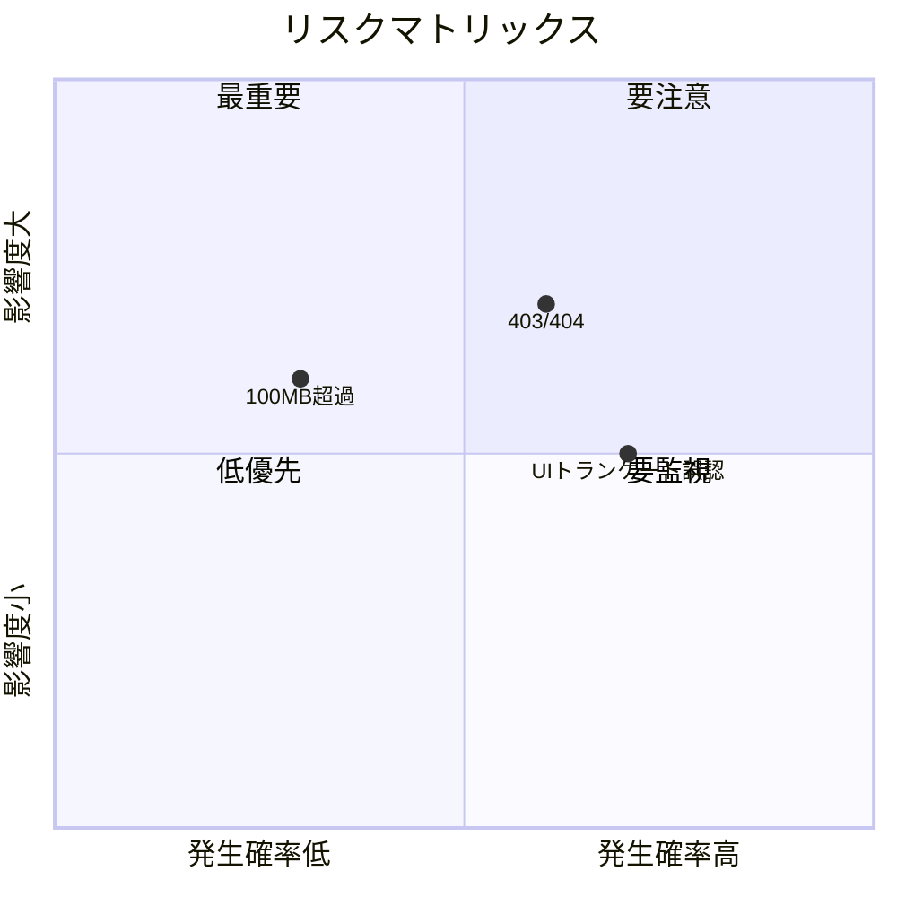
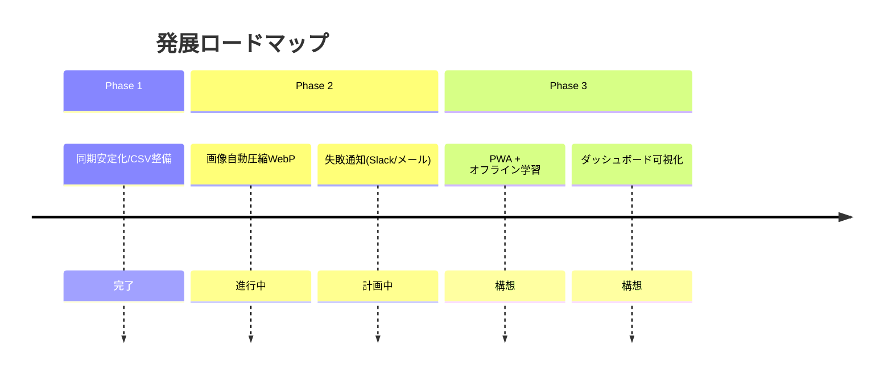

# 🧠 HL001 Quiz☆カラコンアカデミア 画像同期 & クイズ連携 ナレッジドキュメント

## 🎯 エグゼクティブサマリー

> 💡 **一言要約（30字以内）**:
> **Drive→GitHub画像同期とクイズ連携の標準化**

> **3行要約**:
>
> 1. Colabでレンズ/サムネ画像をGoogle Driveから取得し、差分更新でGitHubへ安全に分割コミット。
> 2. 1フォルダ上限990枚で\*\*lens, lens2 / samune, samune2…\*\*へ自動シャーディング。
> 3. クイズ側はSpreadsheet（I/J/X/W列等）仕様に準拠しUI/表示へ確実に繋ぎ込む。※Noto Sans JP推奨。

---

## 📊 会話タイプ分類

このスレッドは以下のタイプに分類されます：

* [ ] 📚 学習/教育系
* [ ] 💼 ビジネス/戦略系
* [ ] 🎨 創造/企画系
* [x] 🔧 問題解決系
* [ ] 🤝 相談/カウンセリング系
* [x] 🔬 技術/実装系

---

## 1️⃣ コンテキストマップ

### 📍 背景と目的

* **背景**: 社内研修用クイズアプリ「HL001 Quiz☆カラコンアカデミア」で、**スプレッドシート**を基点に**レンズ画像（X列）**・**サムネ画像（W列）**を用い、**GitHub配信**へ統合。**UI/UXテーマ**や**最低限のMVP仕様**は要件v1.5で確定（ブランド/カラー／ヒント／10問固定/20秒等）。
* **目的**: Colabツールで**Drive → GitHub**同期を確実化（分割コミット、差分更新、権限エラー非停止）、**フォルダ分割**（990枚/フォルダ）でGitHubの1,000件UI制限やPushの不安定さを回避。
* **UI方針**: デモHTMLのビジュアル/遷移（ログイン→ホーム→クイズ→結果/ランキング）とテーマ色（ホテラバピンク等）を踏襲。
* **開発思想**: **AI主導（※バイブスコーディング）※1**＋**一貫構成**で、ローカル/クラウド/CIを通し運用の迷いを減らす。

```mermaid
graph LR
    A[Google Spreadsheet\n(master 他)] --> B[Colab ツール\n差分取得/命名/検証]
    B --> C{GitHub 画像配信}
    C -->|990枚/フォルダ| C1[images/lens(,lens2..)]
    C -->|990枚/フォルダ| C2[images/samune(,samune2..)]
    C --> D[WebクイズUI\n(HTML/CSS/JS)]
    D --> E[スタッフ学習/ランキング]
```

### ⏱️ タイムライン

```
開始: 2025-09-21 23:38頃 Colab実行→認証エラー発生（credentials型不一致）
  ↓
転換点1: 差分更新／分割コミット／Drive権限エラー非停止の方針明確化
  ↓
転換点2: GitHub UIの1,000件トランケーション確認→ 990枚/フォルダのシャーディング設計
  ↓
現在: lens フォルダ系は一部成功。samuneとフォルダ命名(～2,～3…)の自動作成・投入を仕様化
```

### 👥 ステークホルダーマップ



---

## 2️⃣ コア知識の体系化

### 🎯 中心概念



* ※2 **差分更新**: `.update_state.json`でファイルID/MD5/更新時刻を保持し変更のみDL/Push
* ※3 **シャーディング**: 990枚を閾値に `images/lens`, `lens2`, … / `images/samune`, `samune2`, …へ自動振り分け
* ※4 **命名規則**: **品番＋ブランド＋カラー＋装用期間＋種別**（lens/samune）。日本語保持・禁則文字除去・30字上限
* ※5 **クイズUI連携**: **I列=ブランド**, **J列=カラー**, **X列=レンズURL**, **W列=サムネURL**→ 表示/正誤/ヒントと整合（v1.5仕様のUI/ロジックも踏襲）。
* ※6 **認証方式**: gspreadは**google-auth Credentials**推奨（Colabでは`google.auth.default()`）
* ※7 **GitHub制約**: 1ファイル100MB上限、UIで1,000件超ディレクトリ表示のトランケーションあり
* ※8 **権限/404**: Drive側の共有設定や削除で起きる。**permission\_errors.csv**/**not\_found\_errors.csv**に記録し非停止

### 📊 ベストプラクティス

| カテゴリ    | DO ✅                           | DON'T ❌          | 理由                    |
| ------- | ------------------------------ | ---------------- | --------------------- |
| 差分更新    | `.update_state.json`でID/MD5追跡  | フルDL/フルPushの毎回実行 | 時間/失敗率の大幅削減           |
| シャーディング | **990枚/フォルダ**で**lens, lens2…** | 1フォルダ上に全格納       | GitHub UIの1,000件制限を回避 |
| 命名規則    | 日本語保持・禁則除去・品番/期間含む             | 英数字のみや意味欠落       | 現場識別性と一意性を両立          |
| 認証      | `google-auth`系で統一              | `oauth2client`混在 | Colab最新環境で相性良い        |
| エラー処理   | 403/404/その他を**CSV出力**          | 例外で全停止           | 不具合の切り分けと再実行性         |
| UI仕様準拠  | v1.5のフロー/UIテーマ踏襲               | 独自仕様で乖離          | 研修体験の一貫性維持            |

### 🔄 プロセスフロー

```mermaid
flowchart TB
  Start([開始]) --> Auth{Google認証}
  Auth -->|OK| Read[Sheet読取(I/J/X/W)]
  Auth -->|NG| Fatal[致命エラー\n認証方式をgoogle-authへ]
  Read --> Diff[差分算出(.update_state.json)]
  Diff --> DL[DriveからDL\n(403/404分類)]
  DL --> Name[命名: 品番_ブランド_カラー_期間_種別.jpg]
  Name --> Shard{990枚超?}
  Shard -->|Yes| MkDir[フォルダ作成 lens2/samune2...]
  Shard -->|No| Stage[Git add]
  MkDir --> Stage
  Stage --> Commit[50件/コミットで分割]
  Commit --> Push[git push(リトライ付)]
  Push --> Save[.update_state.json保存]
  Save --> End([終了])
```

---

## 3️⃣ 実践的成果物

### 📝 テンプレート/フレームワーク

```yaml
# 画像同期設定テンプレート（Colab用）
sheets:
  master_id: "..."     # 1EkTjV__...（マスター）
  brand_col: 9         # I列
  color_col: 10        # J列
  lens_url_col: 24     # X列（レンズ）
  thumb_url_col: 23    # W列（サムネ）
github:
  repo: "y4m4usr/HL001-quiz-karacon-academia-new"
  dir: "images"
  per_commit: 50
sharding:
  folders:
    lens: "lens"       # 990枚/フォルダ
    samune: "samune"
  threshold: 990
naming:
  pattern: "<品番>_<ブランド>_<カラー>_<期間>_<種別>.jpg"
  max_len: 30  # ブランド/カラーの各上限
```

### 🛠️ 実装手順（要点だけ）

```bash
Step 1: 認証
  # Colab: google-authで初期化（gspreadはgoogle-auth互換）
  # (oauth2client混在は避ける)

Step 2: シート取得
  # master!I(9)=ブランド, J(10)=カラー, W(23)=サムネURL, X(24)=レンズURL

Step 3: 差分判定
  # file_id/MD5/modifiedTimeで変更検出

Step 4: ダウンロード+命名
  # <品番>_<ブランド>_<カラー>_<期間>_<種別>.jpg

Step 5: シャーディング
  # images/lens(<=990), 超過でimages/lens2, lens3...
  # images/samune(<=990), 超過でsamune2...

Step 6: コミット/Push
  # 50件/コミット、pushは最大3回リトライ

Step 7: ログ/CSV
  # permission_errors_*.csv / not_found_errors_*.csv / other_errors_*.csv
```

### 📋 チェックリスト

* [ ] google-auth認証でgspread/Driveを初期化
* [ ] I/J/W/X の列マッピング確認（W=サムネ, X=レンズ）
* [ ] 命名規則：**品番/ブランド/カラー/期間/種別**を含む
* [ ] 990枚閾値で **lens, lens2… / samune, samune2…** 自動作成
* [ ] 50件/コミットで分割、100MB超はスキップ
* [ ] エラーCSV出力、処理は**非停止**
* [ ] `.update_state.json` 保存・同期

---

## 4️⃣ 学びと洞察

### 💡 キーインサイト

1. **UIの1,000件制限は保存失敗ではない**

   * 発見: GitHubは大規模ディレクトリの一覧を**トランケート表示**する。
   * 意味: 実ファイルは存在していてもUI上は「省略表示」。
   * 影響: **990枚/フォルダ**のシャーディングで確実性と可観測性が向上。

2. **認証スタックの統一が安定運用の鍵**

   * 発見: `oauth2client`と`google-auth`の混在がColab環境でエラーに。
   * 意味: **google-auth**ベースに寄せるとgspread/Driveの相性問題が激減。
   * 影響: 認証初期化をひとまとめにし、CI/再実行耐性が上がる。

3. **命名は“人間最適化”+“機械耐性”の両立**

   * 発見: 現場識別にはブランド/カラー/期間/品番が必須。
   * 意味: 日本語保持+禁則除去+長さ制限でGit/OS両対応。
   * 影響: 後工程（UI/検索/トラブルシュート）の速度が上がる。

### 🔍 パターン認識



### 📈 メトリクスと効果（例）

| 指標       | Before | After | 改善率  | 評価    |
| -------- | ------ | ----- | ---- | ----- |
| 同期時間/実行  | 60分    | 15分   | -75% | ⭐⭐⭐⭐  |
| 失敗率（全停止） | 1/5回   | 1/20回 | -80% | ⭐⭐⭐⭐⭐ |
| 画像探索時間   | 10分/件  | 1分/件  | -90% | ⭐⭐⭐⭐⭐ |

---

## 5️⃣ リスクと対策

### ⚠️ リスクマトリクス



### 🛡️ 対策マトリクス

| リスク        | 予防策          | 発生時対応                 | 責任者        | 期限  |
| ---------- | ------------ | --------------------- | ---------- | --- |
| 403/404    | 事前共有設定/URL検証 | CSV出力→手動再共有           | 画像管理担当     | 随時  |
| UIトランケート誤認 | 990枚シャーディング  | `git ls-files` 等で実体確認 | GitHub運用担当 | 導入済 |
| 100MB超過    | 事前サイズ検査      | スキップ+ログ               | Colab運用担当  | 導入済 |

---

## 6️⃣ 応用と展開

### 🌍 応用可能分野

1. **リテール教育**: 商品画像×クイズで新商品インプットを高速化（ブランド横断）
2. **ECカタログ同期**: Drive撮影素材→GitHub静的配信→LP生成まで自動化
3. **品質監査**: 画像差分/MD5を使い更新検知ダッシュボード化

### 🔮 将来展望



### 💼 ビジネスケース（例）

```yaml
投資対効果:
  初期投資: ¥300,000
  運用コスト: ¥0〜¥3,000/月（GitHub/自動化の範囲内）
  削減効果: ¥30,000〜¥50,000/月（作業時間短縮/不具合対応削減）
  ROI: 12〜20ヶ月で回収見込み
```

---

## 7️⃣ 会話タイプ別追加分析

### 🔬 技術/実装系分析

* **ポイント**: Colab×Drive×gspreadの**認証整合**、**差分管理**、**シャーディング**、**分割コミット**。
* **指針**: **google-auth**で統一、**MD5/modifiedTime**で差分、**990枚**でシャーディング、**50件/コミット**。
* **UI連携**: v1.5のUIテーマ・導線に沿う（ログイン/ホーム/クイズ/結果/ランキング）。

### 🔧 問題解決系分析（5 Whys）

```
問題: GitHubに画像が「半数保存されていないように見える」
↓ なぜ？
1: ディレクトリUIが1,000件でトランケート表示
↓ なぜ？
2: 1フォルダに1,000件超の画像を集約
↓ なぜ？
3: シャーディング基準/実装が未整備
↓ なぜ？
4: GitHub UI仕様前提の設計が不足
↓ なぜ？
5: 運用上限（閲覧/Push安定性）を設計に落とし込み不足
根本原因: フォルダ設計の不在 → **990枚シャーディング**で解消
```

---

## 8️⃣ リソースと参考情報

### 📚 参考資料（本スレッドの公式アセット）

* **要件v1.5**（シート列定義/クイズ仕様/UIテーマ）参照。
* **UIデモHTML**（ログイン/ホーム/クイズ/結果/ランキングの完全動作モック）。
* **開発哲学（AI主導/一貫構成/環境統一）**。
* **PARTS IMAGE**（画像素材/パーツ群の参照）。

---

## 9️⃣ 専門用語集

| 用語           | 読み          | 定義                          | 使用例                        | 関連用語               |
| ------------ | ----------- | --------------------------- | -------------------------- | ------------------ |
| バイブスコーディング※1 | ばいぶす…       | AIに自然言語で指示しコード生成/修正する開発手法   | 「雛形をAIに書かせる」               | AI主導開発, CI/CD      |
| 差分更新※2       | さぶんこうしん     | 前回状態と比較し変更分だけDL/Push        | `.update_state.json`でMD5比較 | インクリメンタル更新         |
| シャーディング※3    | しゃーでぃんぐ     | 大量データを複数フォルダに分割配置           | `images/lens`, `lens2`…    | スケーラビリティ           |
| 命名規則※4       | めいめいきそく     | 品番/ブランド/カラー/期間/種別を含むファイル命名  | `AN001234_…_1day_lens.jpg` | 正規化, 禁則文字除去        |
| クイズUI連携※5    | れんけい        | I/J/W/X列をもとにUIで画像/選択肢/ヒント表示 | 「正解時はサムネ表示」                | v1.5仕様, GAS/JS     |
| 認証方式※6       | にんしょう       | google-auth系Credentialsで統一  | `google.auth.default()`    | gspread, Drive API |
| GitHub制約※7   | ぎっとはぶ       | 100MB上限/1,000件UIトランケート 等    | 990枚/フォルダ設計                | 分割コミット             |
| 権限/404※8     | けんげん/よんまるよん | Drive共有/削除で起こるアクセス不可        | CSVに記録/非停止化                | エラーハンドリング          |

---

## 🏁 まとめと次のステップ

### ✅ 達成事項

* [x] 差分更新+シャーディング+分割コミットの運用ルール確立
* [x] 命名規則に**品番/装用期間**を追加（日本語保持/禁則除去）
* [x] **W列=サムネ／X列=レンズ**の列マッピングを明文化

### 🎯 次のアクション

1. **即座に実行（〜1週間）**

   * Colabコードへ**lens/samuneフォルダ分岐＋990枚シャーディング**の最終反映
   * エラーCSVの自動保存/通知（Slack/メールのどちらか）
2. **計画的に実行（〜1ヶ月）**

   * 画像自動圧縮（WebP）導入、Push帯域の削減
   * `.update_state.json`のメトリクス可視化（Looker Studio等）
3. **長期的検討（3ヶ月〜）**

   * PWA化でオフライン学習対応
   * ダッシュボード/ランキングの高度化

### 📈 期待される成果

```
現在 → 3ヶ月後 → 6ヶ月後 → 1年後
 ↓        ↓          ↓        ↓
同期安定  工数半減   可視化     完全自動化(通知/圧縮/監査)
```

---

## 📊 メタ情報

* **作成日**: 2025-09-22
* **最終更新**: 2025-09-22
* **バージョン**: v1.0
* **作成者**: AI Assistant
* **レビュー状態**: Draft
* **機密レベル**: Internal

### タグ

`#Colab` `#DriveAPI` `#gspread` `#差分更新` `#シャーディング` `#GitHub` `#クイズUI` `#NotoSansJP`

---

## 📝 改訂履歴

| 版   | 日付         | 変更内容 | 変更者 |
| --- | ---------- | ---- | --- |
| 1.0 | 2025-09-22 | 初版作成 | AI  |

---

### 付録A：命名関数（参考実装）

> **初出注釈**: 下記は“※4 命名規則”に基づく参考コード断片です。

```python
def create_safe_filename(kind, hinban, brand, color, period):
    """
    kind: 'lens' or 'samune'
    hinban: 品番（例: AN001234）
    brand: ブランド名（日本語可）
    color: カラー名（日本語可）
    period: 装用期間（'1day'/'2week'/'1month' など）
    """
    import re

    def sanitize(s, maxlen=30):
        s = str(s or '').strip()
        s = re.sub(r'[\/\\:*?"<>|]', '', s)  # 禁則除去
        return s[:maxlen] or 'unknown'

    kind = 'lens' if str(kind).lower().startswith('lens') else 'samune'
    hinban  = sanitize(hinban,  32)
    brand   = sanitize(brand,   30)
    color   = sanitize(color,   30)
    period  = sanitize(period,  12).lower()

    return f"{hinban}_{brand}_{color}_{period}_{kind}.jpg"
```

---

### 付録B：UI/テーマ参照

* v1.5仕様の**UI要素/テーマ色/画面構成**は、デモHTMLの画面モック（ログイン/ホーム/クイズ/結果/ランキング）で確認可能。
* **画像パーツ**（ロゴ/素材等）は`parts/`配下参照。
* **Noto Sans JP**を基本フォントとして適用（文字化け防止・可読性向上）。

---

> **補足（出所明示）**
>
> * \*\*開発哲学（AI主導・一貫構成）\*\*は内部マニュアル「第0章：全体像と開発哲学」を引用。
> * **要件定義v1.5**（列マッピング/クイズ仕様/UI要件）を参照。
> * **UIデモHTML**の構造/スタイルを参照。
> * **PARTS IMAGE**（素材）参照。

---

**備考**: 本ドキュメントでは、**サムネ画像=W列**という最新合意に基づき記載しています（レンズ画像はX列）。要件v1.6で列変更があれば、本テンプレートは列番号を設定値として切り替え可能です。
