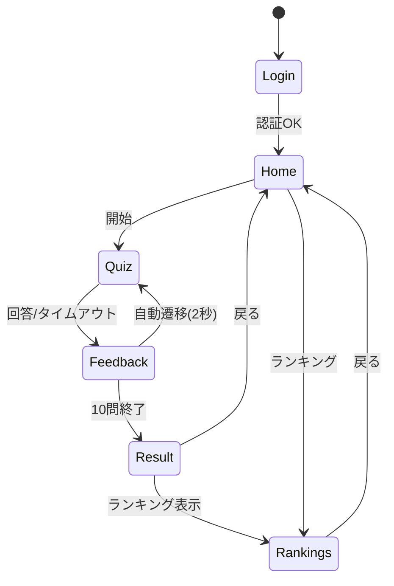
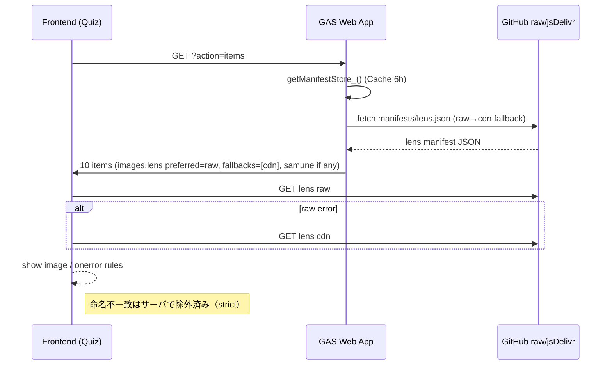

# カラコンクイズアカデミア — **要件定義 v1.9（最終・Strict運用）**

> **本書は v1.8 を唯一の基準**として、あなたからの追加指示（**不一致素材は絶対に非採用／非表示**、シャーディング、manifest 一元化、Colab/日次同期、GAS strict 化、フロントの onerror フォールバック方針、など）を全面反映した最新版です。以降の実装は本 v1.9 に準拠してください。&#x20;

---

## 0. 変更履歴（v1.8 → v1.9）

**重大な差分（Breaking Changes）**

1. **Strict 画像ポリシーを正式採用**

   * G/I/J/K（品番/ブランド(カナ)/カラー(カナ)/装用期間）の**完全一致**で命名された素材のみ採用。**1文字でもズレたら不合格**。
   * **unknown\_\*** 等の暫定ファイル、推測補完は**全面禁止**。**不一致素材はアップしない／manifestに載せない／アプリに出さない**。
   * クイズ本体は **X=レンズ**、正解フィードバックで **W=サムネ**（役割不変）。ただし参照元は**manifest 限定**。&#x20;

2. **GitHub 画像のシャーディング（恒久対策）**

   * `images/lens_shard/00..FF/`・`images/samune_shard/00..FF/` の **256 シャード**に再配置し、「1000枚を超えると入らない」問題を恒久回避。

3. **manifest 一元管理**

   * `manifests/lens.json` / `manifests/samune.json` を\*\*唯一の真実（SSOT）\*\*に。**GAS は manifest ヒットのみ出題対象**。**X/W の手入力は無視**（strict）。&#x20;

4. **日次同期ジョブ（Colab / daily\_update.py）を標準化**

   * Drive→検証→シャード配置→manifest 生成→PR（除外があれば Draft + `non-merge` ラベル）を自動化。

**非互換の可能性**

* 旧 `images/lens/` / `lens2/` / `_lensimage/` 等は移行後に**削除 PR**必須。
* GAS 側は **strict 版 buildItem** へ切り替え（manifest 非該当の商品は候補から落とす）。

---

## 1. 目的・スコープ

* **目的**：店舗スタッフの**カラコン識別**スキル育成（研修用 Web クイズ）。
* **スコープ**：データ同期、クイズ生成～採点、ランキング/成績、画像配信、運用監視。
* **成功条件**：

  * 10問・各20秒、タイムアウトは未回答扱い、**正解時2秒で自動遷移**。
  * **データ完備の商品だけ**から安定出題。表示不具合・素材不一致ゼロ。&#x20;

---

## 2. 用語

* **レンズ画像（X）**：問題表示に用いる左右画像。
* **サムネ（W）**：**正解フィードバック**で表示する小画像（任意。無ければ非表示）。&#x20;
* **Strict**：**一致しない素材を一切扱わない**運用。unknown/推測補完なし。
* **manifest**：検証合格素材だけを記録した JSON（SSOT）。

---

## 3. データ要件（マスタ / カテゴリ / キー）

### 3.1 マスタ（109販促データ / `master`）

|     列 | 名称               | 用途                                      |
| ----: | ---------------- | --------------------------------------- |
| **G** | 品番               | 命名キーに必須                                 |
| **I** | ブランド（カナ）         | 命名キーに必須                                 |
| **J** | カラー（カナ）          | 命名キーに必須                                 |
| **K** | 装用期間             | **命名に必須**（例: `1day`, `2week`, `1month`） |
| P/Q/R | DIA / G.DIA / BC | ヒント表示                                   |
| **W** | サムネURL           | **正解時**のみ使用（strict では manifest から供給）    |
| **X** | レンズURL           | **クイズ本体**で使用（strict では manifest から供給）   |
|    AL | コメント             | ヒント表示                                   |

> **W=サムネ / X=レンズ**の役割は v1.8 に準拠。**K を必ずファイル名に含める**。&#x20;

**固有キー**：`key = sanitize(G) + '|' + sanitize(I) + '|' + sanitize(J) + '|' + normalize(K)`
**命名規則**：`<G>_<I>_<J>_<K>_<type>.jpg`（`type ∈ {lens, samune}` / 拡張子は `.jpg` 固定）

**サニタイズ**：全角英数→半角、全角スペース→`_`、`・,、，／/`→`_`、禁則除去、`_`圧縮、lower。

### 3.2 カラーカテゴリ（出題・誤答抽出）

* I/J と完全一致（サニタイズ後）。**不一致は除外**。誤答 3 件はカテゴリ一致条件で抽出。&#x20;

---

## 4. 画像ライフサイクル（**Strict**）

### 4.1 リポ構造（最終形）

```
images/
  lens_shard/
    00/ 01/ ... FF/           # 256シャード（djb2(key)%256）
  samune_shard/
    00/ 01/ ... FF/
manifests/
  lens.json                    # { key: {file, shard, sha256, w, h}, ... }
  samune.json
```

* **旧フォルダ**（`images/lens/`, `lens2/`, `_lensimage/`, `samune*`）は移行後に**削除 PR**。

### 4.2 検証・採用基準

* **必須**：G/I/J/K がすべて埋まっている。
* **カテゴリ一致**：I/J はカテゴリ表と完全一致（サニタイズ後）。
* **命名一致**：`<G>_<I>_<J>_<K>_{lens|samune}.jpg` に**完全一致**するファイルのみ採用。
* **サイズ/形式**：過大サイズの除外、Web 向け JPG（sRGB/プログレッシブ/Exif なし）が既定。
* **禁止**：**unknown\_\***、推測補完、W/X の自動補完、Drive 直参照。

### 4.3 manifest（SSOT）

* **合格素材だけ**記録。GAS/フロントは**manifest ヒットのみ**を使う。
* **例**（`manifests/lens.json`）：

```json
{
  "hl001|ｱｲｸﾛｰｾﾞｯﾄ|ちびこっぺぱん|1day": {
    "file": "hl001_ｱｲｸﾛｰｾﾞｯﾄ_ちびこっぺぱん_1day_lens.jpg",
    "shard": "3A",
    "sha256": "…",
    "w": 640, "h": 640
  }
}
```

---

## 5. 同期パイプライン（**daily\_update.py**）

### 5.1 処理概要

**Drive → 検証 → シャード配置 → manifest 生成 → Commit/PR → レポート**

```mermaid
flowchart TD
  A[Start daily_update.py] --> B[Read Spreadsheet master & category]
  B --> C[Build key & expected filename]
  C --> D{Validate row (G/I/J/K + category)}
  D -- NG --> X1[Exclude & record reason]
  D -- OK --> E[Download from Drive (X必須 / W任意)]
  E --> F{Strict check: exact name/size/hash}
  F -- NG --> X2[Exclude & record reason]
  F -- OK --> G[Place to images/*_shard/XX/]
  G --> H[Write manifests/lens.json & samune.json]
  H --> I[Write report.md]
  I --> J{Diff?}
  J -- No --> K[Exit]
  J -- Yes --> L[Create branch & commit]
  L --> M{Has excluded?}
  M -- Yes --> N[Open Draft PR + labels(non-merge)]
  M -- No  --> O[Open PR + labels(auto, images)]
  N --> K
  O --> K
```

* **Draft PR**：除外が 1 件でもあれば `non-merge` ラベルを自動付与。
* **Idempotent**：差分なしは PR を出さない。

### 5.2 環境変数（最低）

* `GOOGLE_CREDENTIALS`（サービスアカウント JSON）、`GITHUB_TOKEN`、`DRY_RUN`（任意）。

---

## 6. GAS（**strict**）

### 6.1 manifest ローダ（キャッシュ）

* `manifests/*.json` を **raw → jsDelivr** で取得し、`CacheService`（6h）に保持。
* **目的**：可用性（raw 停止時の CDN フォールバック）。**命名不一致の救済には使わない**。

### 6.2 `buildItemStrict_()`（出題用）

* マスタ行から `key` を生成 → **manifest 照合**。
* \*\*レンズ（必須）\*\*が無ければ **null**（候補から除外）。
* \*\*サムネ（任意）\*\*があれば付与。無ければ `null`（UI で非表示）。
* **X/W の手入力 URL は無視**（strict）。

> v1.8 の「**クイズはレンズ（X）**／**正解時にサムネ（W）**」の役割は変更しないが、**参照元は manifest** に一本化する。&#x20;

---

## 7. Web API（GAS Web アプリ）

* **GET** `?action=items` … **manifest ヒットのみ**から 10 件を返す（brand, color, images, specs など）。
* **POST** `action=submit` … 解答結果を `quiz_history` に **行追記**。
* **GET** `?action=ranking&scope=daily|weekly|monthly` … 期間別ランキング。
* **GET** `?action=mystats&user=...` … 直近10回＋通算サマリ。

  > これらの API 仕様とスコアリング／遷移の要旨は v1.8 の合意を継承。&#x20;

---

## 8. フロントエンド（UI/UX・フォント・画像取得）

### 8.1 画面遷移



* **タイムアウト**＝未回答で次へ。**正解時は 2 秒**で自動遷移。&#x20;

### 8.2 画像表示のフロー（UI）

```mermaid
flowchart LR
  A[item.images.lens.preferred(raw)] -- onerror --> B[jsDelivr CDN]
  B -- onerror --> C[表示失敗扱い(枠/メッセージ)※命名不一致はサーバで除外済]
```

* **lens** は `preferred(raw)` を first hop。**onerror** で **jsDelivr** のみに切替。
* **命名不一致の救済**に CDN は使わない（**strict**でサーバ側が排除済み）。
* **samune** は正解画面にあれば表示、無ければ**枠ごと非表示**。

### 8.3 スタイル / フォント

* **Noto Sans JP**（プロジェクト同梱 woff2 / `font-display: swap`）を**全画面・可視化すべて**に適用（文字化け防止）。
* クリティカル CSS は最小限・同期、フル CSS は遅延読込可。ただし**ログイン等の機能を阻害しない**構成。

---

## 9. スコアリング/ヒント/進行（再掲）

* **問題数**：10、**制限時間**：20秒/問。
* **ヒント**：DIA/G.DIA/BC、コメント（各利用で **-3%**）。
* **誤答**：-10%（下限 0%）。**タイムアウト**は未回答相当。
* **正解フィードバック**：**2秒表示**→自動遷移。出題対象は**データ完備のみ**。&#x20;

---

## 10. 非機能要件

* **可用性**：`raw → jsDelivr` の順でフォールバック（**ネットワーク障害時のみ**）。
* **性能**：画像は Web 最適化（JPG/適正サイズ）。
* **セキュリティ**：Drive は閲覧権（read-only）、GitHub は編集権。サービスアカウントは最小権限。
* **監視**：日次レポート（合格/除外/重複/不整合件数）。除外ありは PR を Draft ＋ `non-merge`。

---

## 11. 運用（Runbook）

1. **毎日 02:00 JST** に `daily_update.py` を実行（CI）。
2. PR が **Draft** の場合：レポートの除外理由を修正 → 再実行 → 通過後にマージ。
3. マージ後、**GAS キャッシュを 6h** として自動更新（必要時は手動無効化）。
4. **旧フォルダの削除 PR** を計画的に実施。リグレッションなしを確認して閉じる。

---

## 12. 検収（UAT）

* 10問すべてで **レンズ画像が左右表示**／不一致素材が一切混入しない。
* タイムアウト・採点・ヒント減点・正解 2 秒遷移が仕様通り。
* `items / submit / ranking / mystats` の API が仕様通り応答。
* ランキングとマイ成績のグラフ・表が **Noto Sans JP** で正しく表示。&#x20;

---

## 13. 実装付録

### 13.1 命名・キー生成（擬似コード）

```js
function sanitize(s) { /* 全角英数→半角, 空白→_, 記号→除去, _圧縮, lower */ }
const PERIOD_MAP = {'1day':'1day','2week':'2week','1month':'1month'};
function normalizePeriod(k){ const x = sanitize(k); return PERIOD_MAP[x] || x; }

function expectedKey(G,I,J,K){
  return [sanitize(G), sanitize(I), sanitize(J), normalizePeriod(K)].join('|');
}
function expectedFilename(G,I,J,K,type){ // type: lens|samune
  return `${sanitize(G)}_${sanitize(I)}_${sanitize(J)}_${normalizePeriod(K)}_${type}.jpg`;
}
```

### 13.2 シャーディング（djb2）

```js
function djb2_256(s){
  let h=5381; for(const ch of s){ h=((h<<5)+h)+ch.charCodeAt(0); }
  return (h>>>0)%256; // 0..255
}
const shard = djb2_256(key).toString(16).toUpperCase().padStart(2,'0'); // 00..FF
```

### 13.3 manifest 構造

```json
{
  "key": {"file":"<...>_lens.jpg","shard":"3A","sha256":"...","w":640,"h":640}
}
```

### 13.4 GAS（strict）要点

* **ローダ**：`getManifestStore_()` が raw→cdn で取得し `CacheService` に保存。
* **buildItemStrict\_**：`key` で `store.lens[key]` を照合、なければ `null`（除外）。

---

## 14. 参照

* **要件定義 v1.8**（本 v1.9 の基底。X/W 役割、K 含む命名、クイズ/フィードバック、API 概要を継承）｡&#x20;

---

### 付録図：画像取得（サーバ＋クライアント総覧）



---

> **最終確認**：
>
> * **Strict**（不一致素材ゼロ）／**シャーディング**／**manifest 一元化**／**raw→cdn**（ネットワークのみ）／**X=レンズ / W=サムネ**（v1.8 準拠）という **5 本柱**を本 v1.9 に明文化。以降、実装・運用・レビューは本書を唯一の正とします。&#x20;
